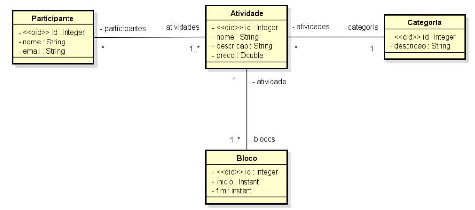
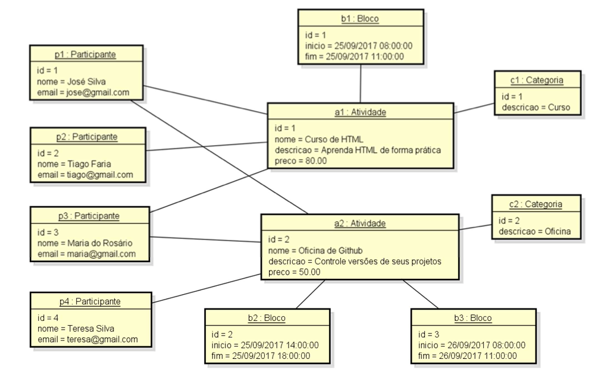

## DESAFIO: Modelo de domínio e ORM

#### Este é um desafio do módulo Modelo de Dominio e ORM do curso Java Spring Professional - devsuperior.

### Descrição

Você deve criar um projeto no Spring Boot com Java e banco de dados H2, e implementar o modelo conceitual conforme especificação a seguir. Além disso, você deve fazer o seeding da base de dados conforme diagrama de objetos que segue.

### ESPECIFICAÇÃO - Sistema EVENTO:
Deseja-se construir um sistema para gerenciar as informações dos participantes das atividades de um evento acadêmico. As atividades deste evento podem ser, por exemplo, palestras, cursos, oficinas práticas, etc. Cada atividade que ocorre possui nome, descrição, preço, e pode ser dividida em vários blocos de horários (por exemplo: um curso de HTML pode ocorrer em dois blocos, sendo necessário armazenar o dia e os horários de início de fim do bloco daquele dia). Para cada participante, deseja-se cadastrar seu nome e email.

### Instância dos dados para seeding

**Serviço OrderService:** responsável por operações referentes a pedidos.
Serviço ShippingService: responsável por operações referentes a frete.
Sua solução deverá ser implementada em Java com Spring Boot. A saída deverá ser mostrada no log
do terminal da aplicação. Cada serviço deve ser implementado como um componente registrado com
@Service.